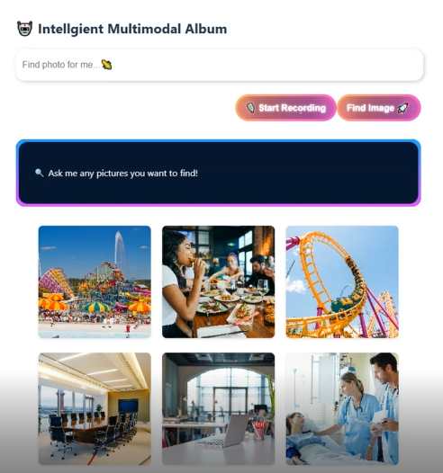

# Multi-Modal Intelligent Album

This is an multimodal intelligent album management system.

The primary objective of this project is to develop a Multi-modal Intelligent Album that integrates advanced image search, retrieval, and filtering capabilities by utilizing the power of cutting-edge LLMs and multi-modal tools, enabling users’ efficient interaction with their image albums in a more intuitive and seamless manner.
Our key goals include reducing query times compared to traditional image search methods and enhancing the accuracy of retrieval through fuzzy search of text descriptions, finding similar images, or other multi-modal interactions. The project also seeks to improve the user experience by supporting diverse input modalities, making image retrieval more accessible and efficient across different user preferences. Expected outcomes include a prototype of a fully-functional multi-modal album search system based on Web browser, improved query response times, and an enhanced user interface that supports text, voice, and image interactions.

